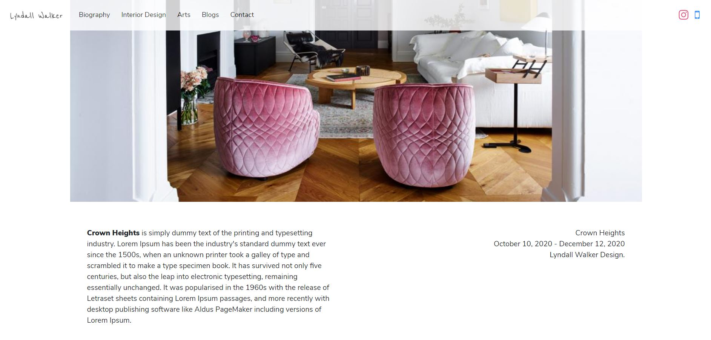

  
  <h1 align="center">Lyndall Walker Design</h1>
  

    This is a professional website for a new interior designer, Lyndall Walker Design.

<!-- ABOUT THE PROJECT -->
## About The Project

### Built With

* HTML/CSS
* Bootstrap4

<!-- GETTING STARTED -->
## The Process and What I have learned

### The Process

  This was a part of my school project, and I worked with a client, a residential interior designer in Brooklyn, NY.
  She recently started her business in the interior design industry and needed help to build her first professional website.
  I have connected her over the common interest in interior design and thought I could help her with her needs.
  I documented the detailed process and worked with her closely throughout the project to reflect her needs on the website.

### Lesson Learned

This was my first project working with a client for a real-world problem. First, I learned that communication is crucial. Due to COVID-19, we could not hold any in-person meetings. I needed to put extra effort into making up those in-person meetings by giving her frequent status reports and project updates. I often recorded the discussions and messages to go back to them to understand the client's needs better. I did not want to bother the client by asking the same questions, so I made sure I understood completely before moving onto the next topics. 

I had to manage my time well as I had many other projects that I was working on, and I found having a scheduler with me all the time helpful. I made sure to complete any tasks that were time-sensitive and high-priority. Sometimes I needed to skip cooking dinner to complete the projects on time, and I found that doing meal preps can help me when I'm busy working on many projects. 

Also, I learned that it is always better to know what the client thinks earlier than later. And negotiating with the client about what you can do and cannot do within a required time and cost is essential. I tried my best to avoid a scope creep, but fortunately, I could finish the project a few days earlier than expected to add extra features.

Although my overall project method is closer to the waterfall method than agile, I often finished different parts quickly, tested them with the client, and improved based on the client's feedback and advice. This was a great project where I learned how it is like to work with a client. 

